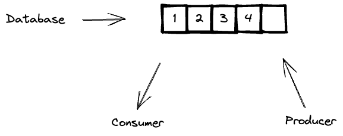
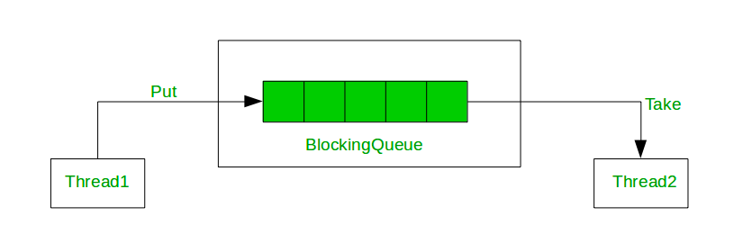

# Producer - Consumer exercise
The goal of this excercise is to create a producer / consumer algorithm

___

## The problem
In this pattern, we will have a **producer** that is going to produce elements to a storage and also, 
we will have a **consumer** that is going to consume the next existing element in the storage.

We need to consider the following restrictions in the problem:
1. The Storage has a limit of elements that is able to store.
2. The producer will produce one element at a time.
3. If the producer wants to add an element to the storage but the storage is null, then the producer will need to wait
    for the consumer to consume one element from the storage so the new element can be added.
4. The Consumer will consume one element at a time.
5. If the consumer wants to consume an element from the storage but there are no elements to be consumed, then the consumer
    will need to wait for the producer to produce a new element in the storage so that it's available to be consumed.

___

## The Solution
In my solution, I'm using the BlockingQueue data structure to solve the problem.
* I'm creating a `Database` class which will work as an abstraction for the BlockingQueue data structure.
* I'm creating a `Producer` class which is a thread that will produce elements infinitely to the database.
* I'm creating a `Consumer` class which is a thread that will consume elements from database infinitely.  

#### The BlockingQueue interface:
A BlockingQueue is a java interface data structure that _**_blocks you when you try to get an element from it and the queue is empty, 
and also, in the other hand, it blocks you when you try to add new elements to the queue but the queue is full_**_.  

The interface has 2 possible implementations:
<table>
    <tr>
        <td><b>ArrayBlockingQueue</b></td>
        <td><b>LinkedBlockingQueue</b></td>
    </tr>
    <tr>
        <td>It stores the elements internally in an array.</td>
        <td>It stores the elements internally in linked nodes.</td>
    </tr>
    <tr>
        <td><b>ArrayBlockingQueue is bounded</b> which means the size will never change after its creation.</td>
        <td><b>LinkedBlockingQueue is optionally bounded</b> which means it can optionally have an upper bound if desired. 
            If no upper bound is specified, Integer.MAX_VALUE is used as the upper bound.
        </td>
    </tr>
    <tr>
        <td>It has lower throughput than linked nodes queues.</td>
        <td>It has a higher throughput than array-based queues.</td>
    </tr>
    <tr>
        <td>It uses the single-lock double condition algorithm. It means that producer and consumer share a single lock.</td>
        <td>It uses two lock queue algorithms and it has two lock conditions putLock and takeLock for 
            inserting and removing elements respectively from the Queue.
        </td>
    </tr>
    <tr>
        <td>ArrayBlockingQueue always holds an object array</td>
        <td>LinkedBlockingQueue is a linked node with an object with three object fields.</td>
    </tr>
</table>

