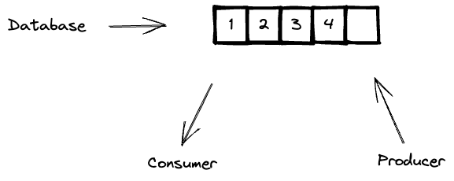

# Producer - Consumer exercise

This is an alternative solution to the Producer / Consumer exercise did in [this other repository](../ProducerConsumer/README.md).  
In this case, I'm using a Wait / Notify strategy.

___  

The goal of this excercise is to create a producer / consumer algorithm

___

## The problem
In this pattern, we will have a **producer** that is going to produce elements to a storage and also, 
we will have a **consumer** that is going to consume the next existing element in the storage.

We need to consider the following restrictions in the problem:
1. The Storage has a limit of elements that is able to store.
2. The producer will produce one element at a time.
3. If the producer wants to add an element to the storage but the storage is null, then the producer will need to wait
    for the consumer to consume one element from the storage so the new element can be added.
4. The Consumer will consume one element at a time.
5. If the consumer wants to consume an element from the storage but there are no elements to be consumed, then the consumer
    will need to wait for the producer to produce a new element in the storage so that it's available to be consumed.

___

## The Solution
In my solution, I'm using the a Wait / Notify strategy to solve the problem.
* I'm creating a `Database` class which will work as an abstraction for the storage of the elements.
* I'm creating a `Producer` class which is a thread that will produce elements infinitely to the database.
* I'm creating a `Consumer` class which is a thread that will consume elements from database infinitely.  

=== TODO -> provide information about how wait and notify methods work ===